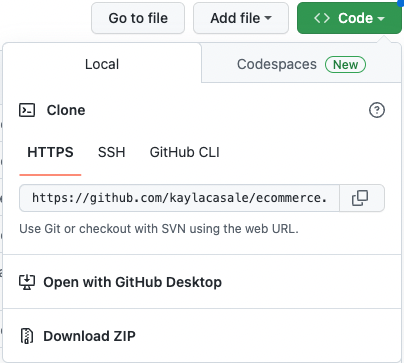
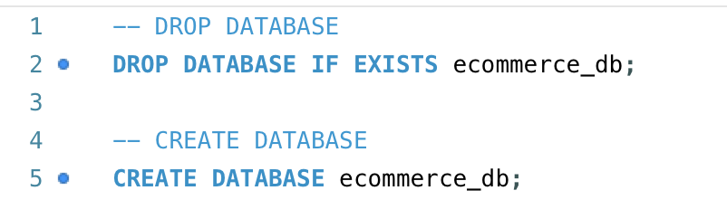
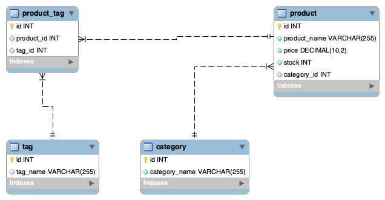
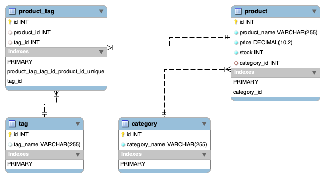

# E-Commerce Back-End: Object-Relational Mapping (ORM)
A back-end application for an e-commerce site. This application requires the configuration of Express.js API in order to use Sequelize to interact with a MySQL database and dotenv npm package to secure user information. The application demonstrates the API routes (in the controllers folder) to perfom RESTful CRUD operations visualized through Postman in the walkthrough video below.

# ecommerce
E-Commerce or Electronic Commerce is a type of business model which enables companies and customers to buy and sell goods online or with the help of the internet. Online shopping is growing so fast and is increasingly relied upon by people around the world. The website plays the most crucial part in creating and maintaining the online presence and reputation of an E-Commerce business. In today's business, web development plays a key role in E-Commerce business. 

## User Story
```md
AS A manager at an internet retail company
I WANT a back end for my e-commerce website that uses the latest technologies
SO THAT my company can compete with other e-commerce companies
```
## Table of Contents
* [Description](#description)
* [Installation](#installation)
* [Usage](#usage)
* [Built With](#built-with)
* [ERD](#erd)
* [Walkthrough Video](#walk-through-video)


## Description
E-Commerce web development has two faces- 1) Front-end development 2) Back-end development. This application focuses on the back-end using MySQL2 and Sequelize packages to connect the Express.js API to a MySQL database and the `dotenv` package and use environment variables to store sensitive data (e.g. username, password, and database name). Lastly, using any API platform that allows developers to design, build, test, and iterate their APIs (e.g. Insomnia), I test all controller routes (`GET`, `POST`, `PUT`, `DELETE`) through **Postman** with the help of command-line functions in the ScreenCasitfy walkthrough-video below!

## Installation
- [x] Clone the GitHub repository locally
- [x] Install necessary dependencies
- [x] Create schema from the MySQL shell
- [x] Seed the database from the command-line

1. To clone this project from GitHub to your local computer

> Click the Code drop-down button in this page and Copy URL for that repository:



> Enter the following command in your terminal on the level of your project folder (assuming you have Git installed)

    `git clone <URL>`
    > URL = https://github.com/kaylacasale/ecommerce.git


2. To install neccessary packages

This application uses Node.js, Express.js, MySQL2, Sequelize, and the dotenv package to run on the command-line.

> Enter into the terminal in your source folder

    `npm install`

OR

    `npm i`

> Alternative: install each dependency manually

    `npm i dotenv`

    `npm i express`

    `npm i mysql2`

    `npm i sequelize`


3. Create employee-tracker database in your MySQL Workbench

> Enter `schema.sql` content into your MySQL Workbench


4. Seed the Database
> Enter into the command-line after creating database in SQL:

    `npm run seed`

OR

    `node seeds/seed.js`

**Personalize your seeds *directly* by changing the files within the `seeds` folder or *dynamically* through the Sequelize functions**

## Usage
To start the application, run the following command(s) in the commend-line.

    `node server.js`
OR

    `npm run start`

This application lets you do the things:
```md
GIVEN a functional Express.js API
WHEN I add my database name, MySQL username, and MySQL password to an environment variable file
THEN I am able to connect to a database using Sequelize
WHEN I enter schema and seed commands
THEN a development database is created and is seeded with test data
WHEN I enter the command to invoke the application
THEN my server is started and the Sequelize models are synced to the MySQL database
WHEN I open API GET routes in Insomnia for categories, products, or tags
THEN the data for each of these routes is displayed in a formatted JSON
WHEN I test API POST, PUT, and DELETE routes in Insomnia
THEN I am able to successfully create, update, and delete data in my database
```

## Built With

```diff
+ HTML
+ CSS
+ JavaScript

# Node.js
! Express.js
- MySQL 
- Sequelize
* npm
    * dotenv

* Postman
* Command-line
* Adobe XD (design wireframe/ERD)
```


## ERD (Entity-Relationship-Diagram)
> Generated through MySQL Workbench `Reverse Engineer` Database function after seeding and running the application


>> showing indexes




## Walthrough Video


https://user-images.githubusercontent.com/115776118/216014311-b8921b39-df18-4bdc-a746-9aceb9dde0c0.mp4

